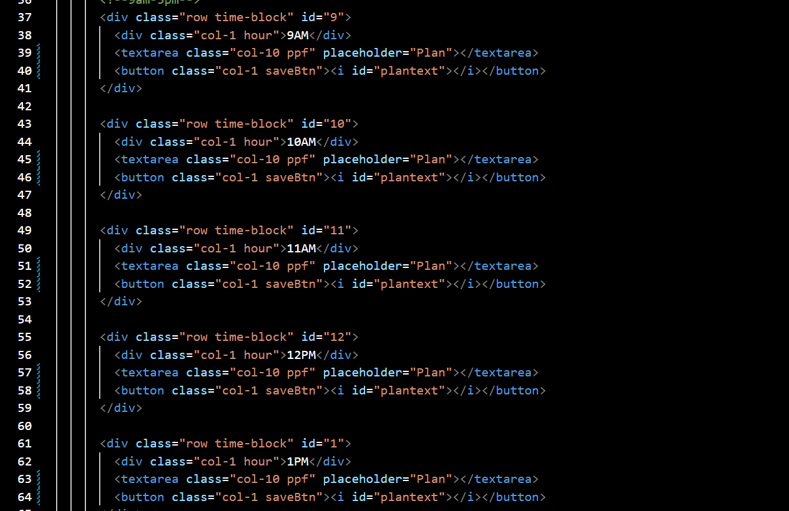

# Work Day Scheduler Starter Code + Improvements

## In order to use this scheduler you would have to input your text then save it.

### Example with Screenshot
# 
### This shows how I used Bootstrap's grid system in order to make one of the shining features in this website!

#### Check out the website! https://marvssvil.github.io/workday-schedule/